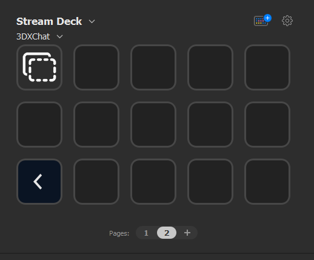

# Keymaster

Hello, 3DX chatter! So you are the proud owner of a stream deck and want to be just like me and
send your favorite ASCII art by the tip of your fingers? Well, power to your fingers. You will need them a lot in this game :)



## How does this bloody thing work

First, drag a ***Send Text*** action onto the stream deck to start configuring it. Second past in your
text / ASCII art and press save. When you are in the game, make sure your cursor is inside the chat text field and press the button you just created your action. Your message will now be send to 3DXChat.


## Install the plugin

First of all, make sure you have closed the Stream deck application. To install the plugin copy and paste the ***io.silentboy.keymaster.S.sdPlugin*** directory into the following folder:

```
%appdata%\Elgato\StreamDeck\Plugins\
```

## The author

My name is Silentboy. You might know me from the Sin club (say hi). Of course, this is not my real name but I don't want to reveal my real name here since not everyone in Sin likes me (Shoutout to Clittywinks). Just say hi when you see me if you will use the plugin and I will be happy (it's free after all).

PS: Happy hump day.

